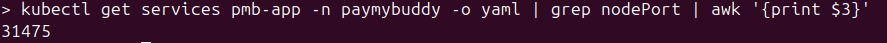
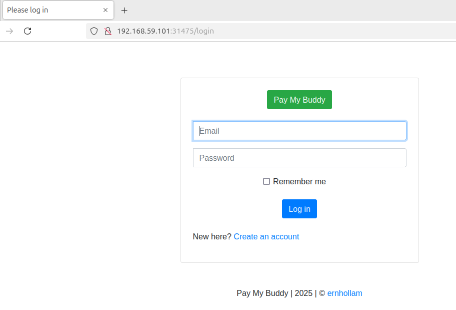

## prerequisites:

- Running kubernetes cluster
- kubectl binary

#### Deploy PayMyBuddy on your node(s) :

For attributes db-user, db-pass and db-root-pass in the file 02_db-secrets.yml, replace the pattern **"<BASE64_ENCRYPTED_VALUE>"**, with the value of the following command :

```
> echo -n '<desired_value_of_each_attribute>' | base64
```


Then launch the deployment :

```
> kubectl apply -f 01_pmb-namespace.yml && sleep 2 && for resource in `ls -1 *x*.yml | sort`; do kubectl -n paymybuddy apply -f $resource && sleep 2; done
```


Finally, in order to access your newly deployed PayMyBuddy app, you'll need to get the service port :

`> kubectl get services pmb-app -n paymybuddy -o yaml | grep nodePort | awk '{print $3}'`



And send a request to your kubernetes node, using this port :



