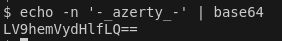
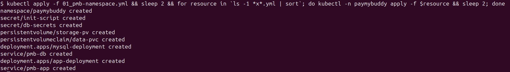
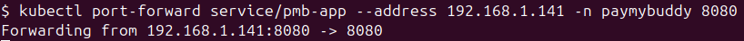
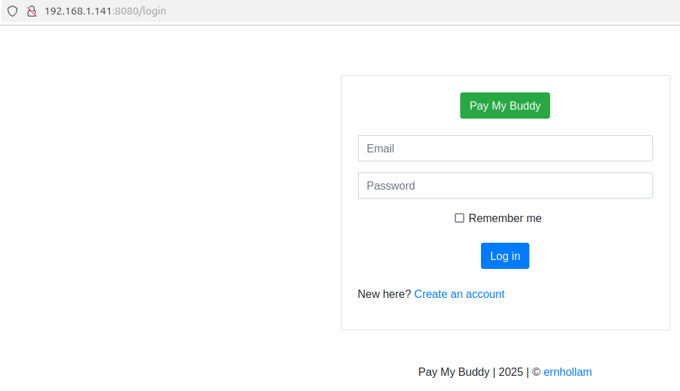

## prerequisites:

- running minikube
- kubectl binary

> !!!DISCLAIMER!!!
> 
> In case you're using the minikube docker driver, you'll have to change the value of 'iptables.masqueradeAll' to true in the kube-proxy confimap, and restart the corresponding pod :
> 
> \> kubectl -n kube-system edit cm kube-proxy
> 
> \> kubectl -n kube-system delete pod -l k8s-app=kube-proxy
> 
> !!!DISCLAIMER!!!

#### Deploy PayMyBuddy on your node(s) :

For attributes db-user, db-pass and db-root-pass in the file 02_db-secrets.yml, replace the pattern **"<BASE64_ENCRYPTED_VALUE>"**, with the value of the following command :

```
> echo -n '<desired_value_of_each_attribute>' | base64
```



Then launch the deployment :

```
> kubectl apply -f 01_pmb-namespace.yml && sleep 2 && for resource in `ls -1 *x*.yml | sort`; do kubectl -n paymybuddy apply -f $resource && sleep 2; done
```



Finally, in order to access your newly deployed PayMyBuddy app, you'll need to forward the port :

`> kubectl port-forward service/pmb-app --address <IP_OF_MINIKUBE_HOST> -n paymybuddy 8080`





